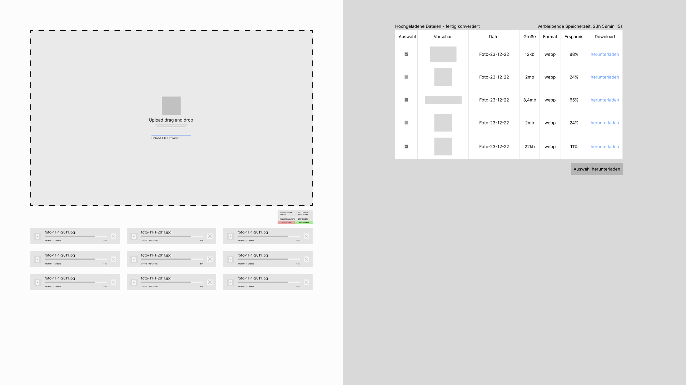
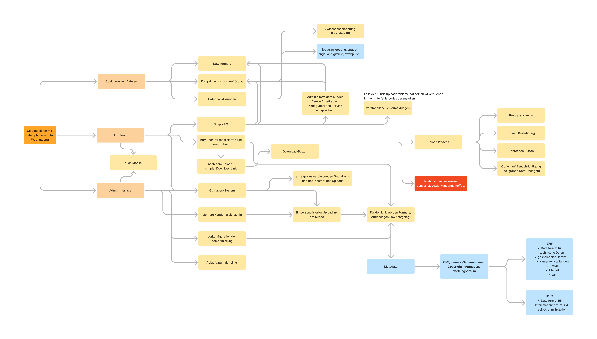
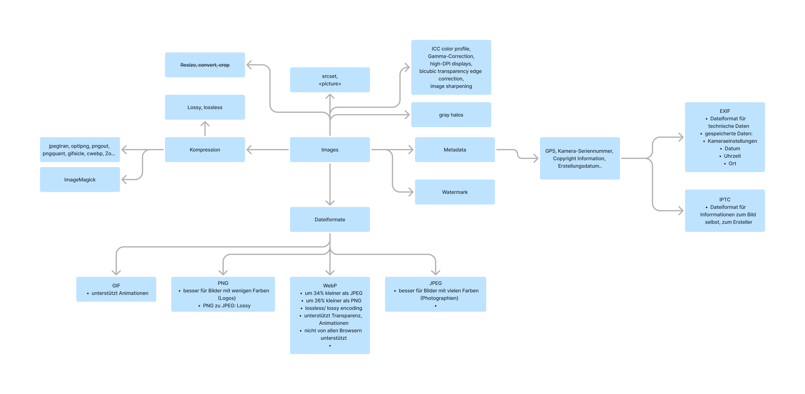
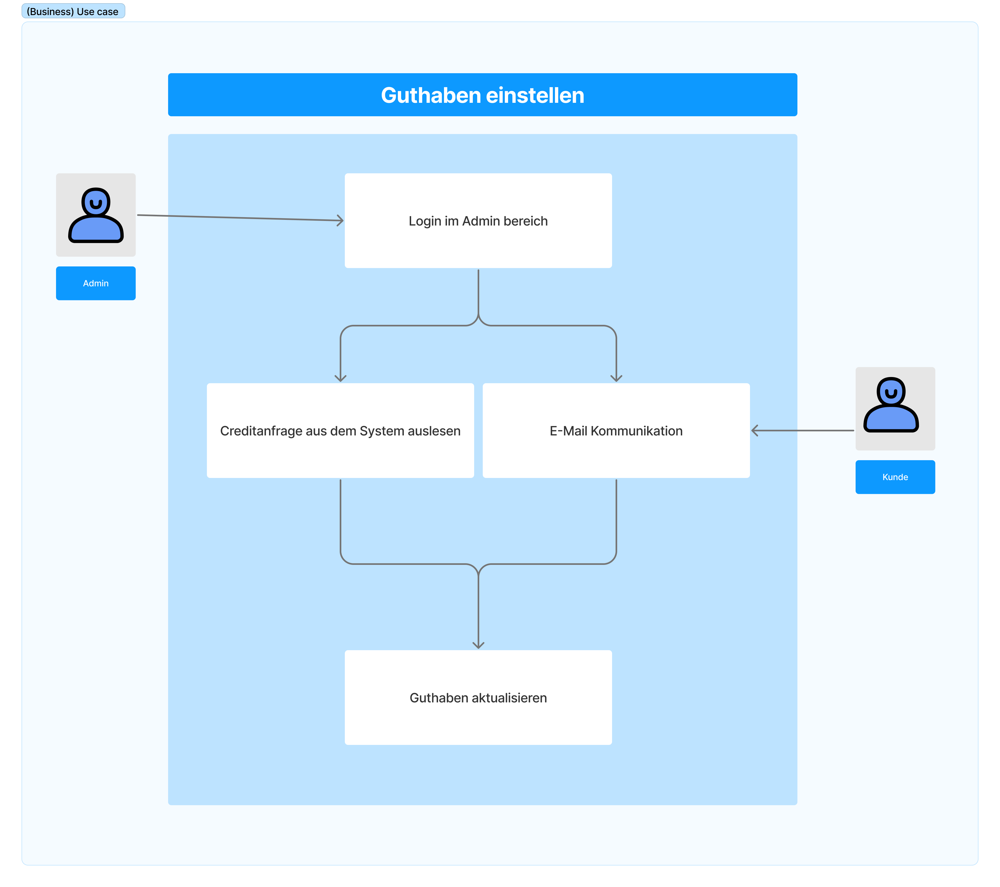
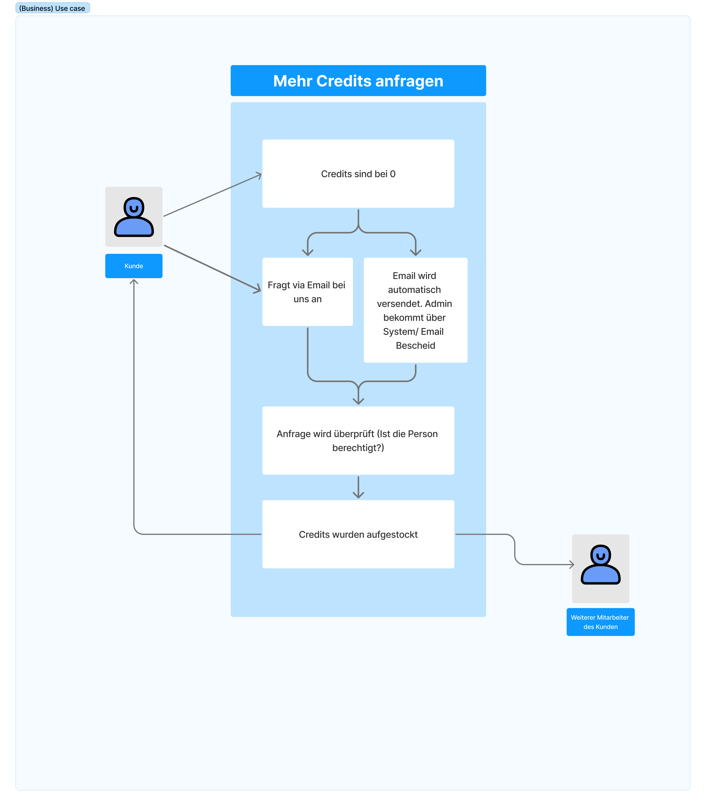
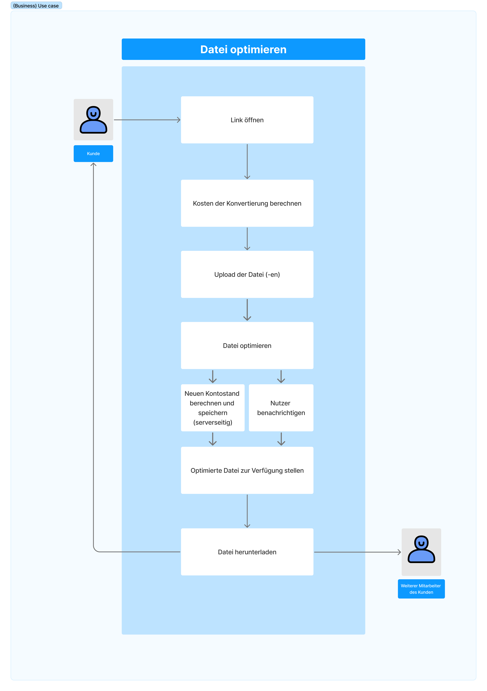
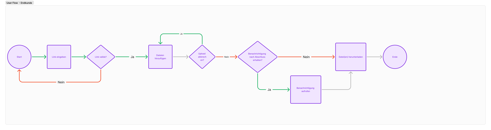
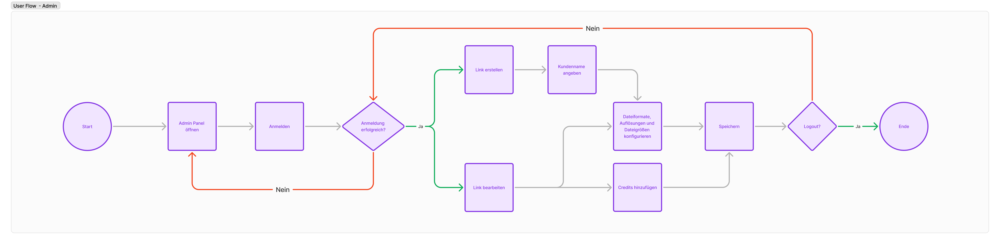
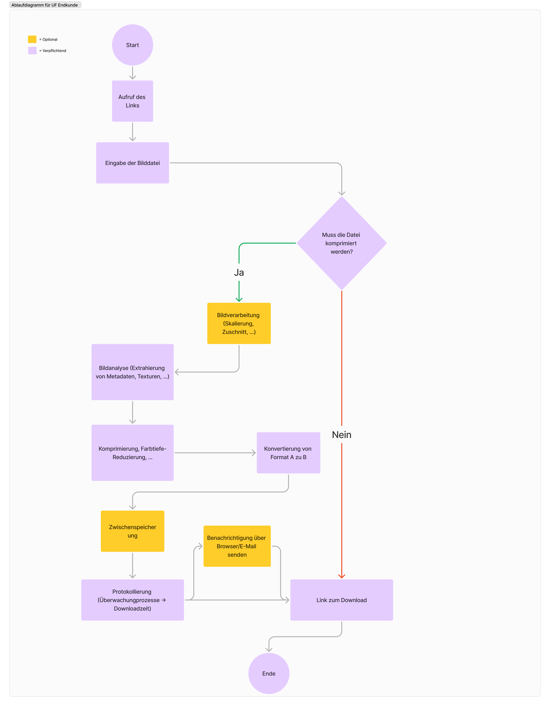

# Zusätzliche Markdown Datei zum Audit 1

## Inhalt

[Modulseite](https://cnoss.github.io/entwicklungsprojekt/)

1. [Github Wiki](https://github.com/MaximilianKellner/ep-2024-web-development/wiki)
2. [Wireframe](https://github.com/MaximilianKellner/ep-2024-web-development/blob/main/Audits/audit1/audit-1.md#wireframe-zur-upload-und-konvertierungsseite)
4. [Concept Map](https://github.com/MaximilianKellner/ep-2024-web-development/blob/main/Audits/audit1/audit-1.md#concept-map)
5. [Concept Map mit Schwerpunkt Bildverarbeiteitung](https://github.com/MaximilianKellner/ep-2024-web-development/blob/main/Audits/audit1/audit-1.md#concept-map-mit-schwerpunkt-bildverarbeitung)
6. [Use Cases](https://github.com/MaximilianKellner/ep-2024-web-development/blob/main/Audits/audit1/audit-1.md#use-cases)
7. [User Flows](https://github.com/MaximilianKellner/ep-2024-web-development/blob/main/Audits/audit1/audit-1.md#user-flows)

## Wireframe zur Upload und Konvertierungsseite

## Concept Map

## Concept Map mit Schwerpunkt Bildverarbeitung

## Use Cases

## User Flows

